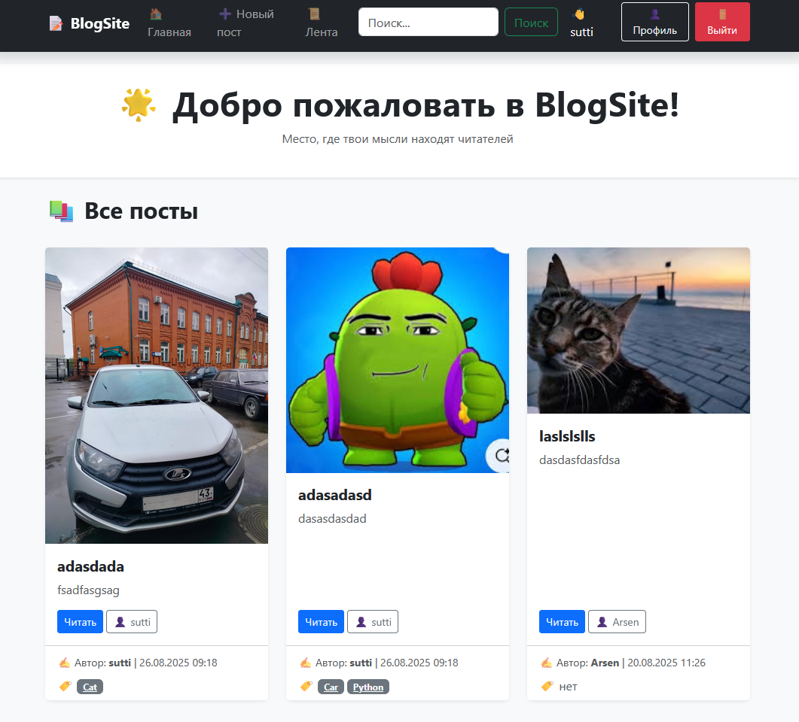
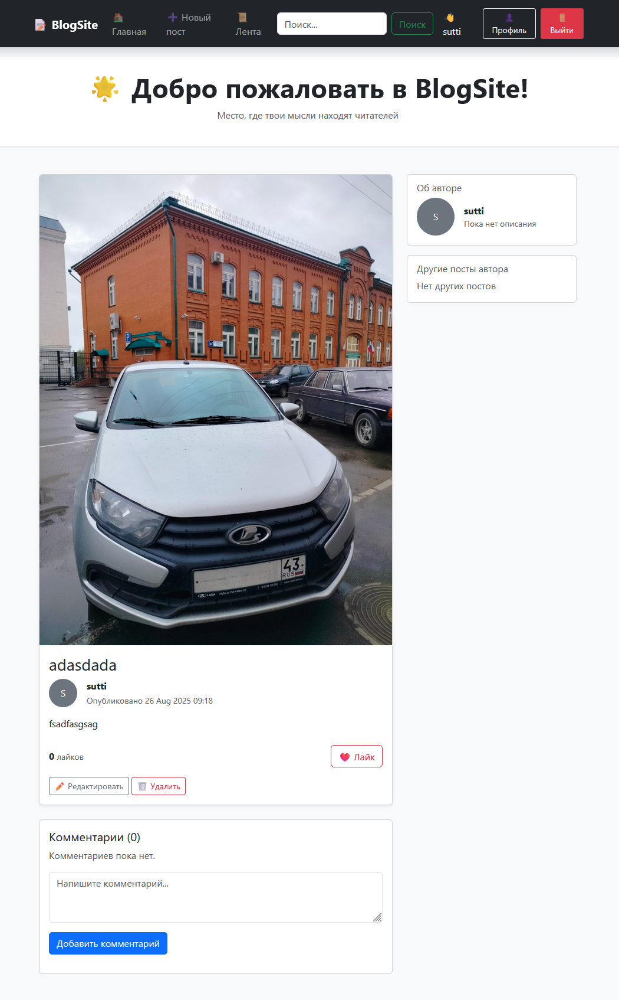
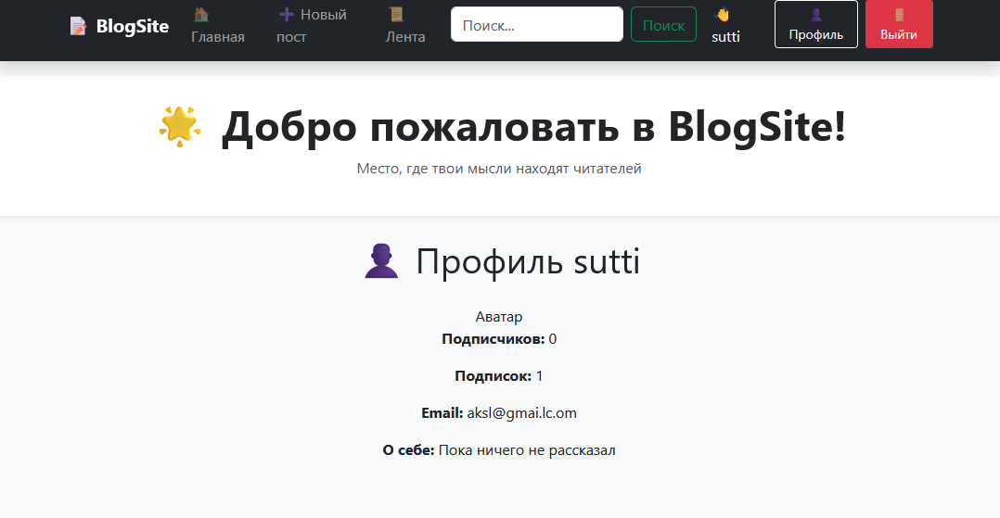

# 📝 BlogSite

Мини-блог на **Django**, где пользователи могут публиковать посты, подписываться друг на друга, ставить лайки и оставлять комментарии.  
Проект создан как пет-проект для изучения Django.

---

## 🚀 Функционал
- 🔐 Регистрация / Авторизация пользователей  
- 👤 Профиль пользователя + возможность подписки  
- ✍️ CRUD для постов (создание, редактирование, удаление)  
- 💬 Комментарии к постам  
- ❤️ Лайки для постов (AJAX)  
- 🏷️ Теги и поиск по тегам / тексту  
- 📜 Лента постов от авторов, на которых подписан  
- 📑 Пагинация списка постов  
- 🖼️ Поддержка изображений к постам  

---

## 🛠️ Технологии
- [Python 3.x](https://www.python.org/)  
- [Django 5.x](https://www.djangoproject.com/)  
- [Bootstrap 5](https://getbootstrap.com/)  

## ChatGPT
- Front-End часть написана с помощью ChatGPT 3.0

## 📸 Скриншоты

### 🏠 Главная страница

### 📖 Детали поста

### 👤 Профиль пользователя

---

## ⚡ Установка и запуск

1. Клонировать репозиторий:

Создать виртуальное окружение и активировать его:
   python -m venv venv
   source venv/bin/activate   # для Linux/Mac
   venv\Scripts\activate      # для Windows

Установить зависимости:

pip install -r requirements.txt

Применить миграции:

python manage.py migrate

Создать суперпользователя:

python manage.py createsuperuser

Запустить сервер разработки:

python manage.py runserver

Открыть в браузере:
👉 http://127.0.0.1:8000

Проект создан в учебных целях ❤️ на Django.
